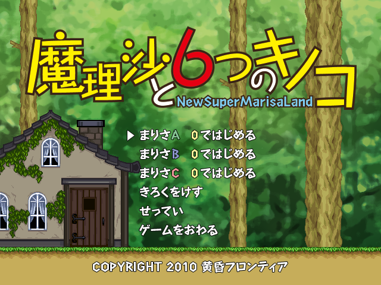

# 6kinoko Rebuild

[English](README.md) | 简体中文

以原版反编译证据和 Squirrel 2.2.2 源码为依据，重建能够读取原版 `6kinoko_*.dat` 的游戏程序。当前目标是还原 Windows 上的运行行为，最终目标是跨平台。



*重建运行时从原版 DAT 资源加载并渲染出的标题画面。*

## 当前状态

- [PR #13](https://github.com/Poker-sang/6kinoko-rebuild/pull/13) 已合并，合并提交为 `76443ccbcb15b93112fcb677f57b1c00c3615ac8`。
- 主运行宿主已迁为 C++17；内部指针、已恢复字段布局、所有权及重复旧接口的本轮整理已完成。具体范围与保留依据见 [迁移台账](../docs/internal-types-20260926/README.md)。
- 最新用户确认正常的产物为 `internal-types-59`，构建源码 `8047e62c1c75a1aabc611a6bff812c5148ec3433`。用户反馈“运行没问题”；游戏与 65 个 contract 程序已编译，代理未执行游戏或自动测试。
- 当前游戏仍要求 **Windows x86、MSVC**。平台后端与 x64 迁移尚未完成；保留的布局断言、真实虚调用、协议整数及未知字节不能随意删除。

## 构建

需要 Windows、Visual Studio 2022 的 C++ 桌面开发组件、Windows SDK 和 CMake 3.24 或更新版本。原版三个 DAT 由用户自行提供；Squirrel 等源码依赖位于 `third_party/`，构建配置以顶层 CMake 为准。

从仓库根目录运行以下命令。源码修改应先提交；每批使用新的名称，脚本拒绝覆盖既有构建产物。

```powershell
powershell -NoProfile -ExecutionPolicy Bypass -File .\tools\build_staged.ps1 `
  -Name win32-release-next `
  -SourceDir C:\WorkSpace\6kinoko `
  -Generator "Visual Studio 17 2022"
```

将 `SourceDir` 替换为实际原版资源目录。该命令构建 Win32 Release 无日志版，编译 contract 程序，复制并校验三个 DAT，**不运行游戏或测试**。

| 路径 | 内容 |
| --- | --- |
| `build-runs/win32-release-next/` | CMake 构建树、源码 commit、构建日志和 `artifacts.json` |
| `runtime-builds/win32-release-next/kinoko_retdec_rebuild.exe` | 游戏程序 |
| `runtime-builds/win32-release-next/6kinoko_[a-c].dat` | 经大小与 SHA256 校验的原版资源 |
| `runtime-builds/win32-release-next/tools/` | contract 与开发工具 |

## 运行与验证

由用户运行：

```powershell
powershell -NoProfile -ExecutionPolicy Bypass -File .\tools\run_staged.ps1 `
  -Executable .\runtime-builds\win32-release-next\kinoko_retdec_rebuild.exe `
  -Wait
```

游戏必须从 EXE 自身目录读取三个 DAT；不能用参考目录作为工作目录，或用 `--data-dir` / `KINOKO_DATA_DIR` 绕过资源部署。部署脚本不复制 `index.dat`，也不复制或覆盖原版 `marisa[A-C].dat` 存档。

构建成功、contract 编译成功和实际运行通过分别记录。游戏运行验证由用户执行；本批工作流修复已获授权，可由代理执行本地自动测试。所有历史构建、日志及失败产物保留。

## 源码导航

| 目录／文件 | 职责 |
| --- | --- |
| `src/reconstructed/runtime_host.cpp` | C++ 运行宿主与全局服务 |
| `src/reconstructed/runtime_method_tables.cpp` | 已恢复的具名虚表 |
| `src/reconstructed/`、`include/kinoko/` | 游戏运行链、字段记录与所有权接口 |
| `src/squirrel/`、`third_party/squirrel-2.2.2/` | 脚本桥接与源码 VM |
| `src/platform/` | 当前平台相关支持；其他运行模块也仍有 Windows 依赖 |
| `src/decompiled/6kinoko.exe.c` | 原版反编译证据，不参与游戏实现编译 |
| `tests/`、`tools/` | 回归夹具、资源检查和诊断工具 |

`6kinoko_rebuilt.c` 与旧 `retdec_asm_stubs` 已不再是运行实现。EXE、部分 CMake 目标及诊断宏中的 `retdec` 保留兼容命名，不能据此判断仍在编译旧 C 宿主。

## 文档入口

- [迁移现状与下一步](../MIGRATION.md)
- [本轮完成清单与保留台账](../docs/internal-types-20260926/README.md)
- [最终构建交接](../docs/internal-types-20260926/HANDOFF.md)与[产物校验记录](../docs/internal-types-20260926/artifacts.json)
- [工具与诊断说明](../tools/README.md)
- [维护约定](../AGENTS.md)

`docs/` 中旧批次文档保存当时的证据、构建和验证状态；其待办、路径和估计不自动代表当前剩余工作。
## 贡献与许可

修改应以原版反编译、汇编、调用点和对象布局为依据，不增加原版不存在的游戏规则。仓库不提供原版游戏 EXE、DAT 或存档；请自行提供合法取得的资源。不要提交资源、存档、转储或本地分析数据库。

本项目原创代码采用 [MIT 许可](../LICENSE)。该许可不授予原版游戏、资源、脚本及其他恢复材料的权利。本项目为非官方项目，与原作者没有隶属或背书关系。Squirrel 2.2.2、zlib 1.2.3 等第三方组件保留各自许可，见 `third_party/` 中的声明。
